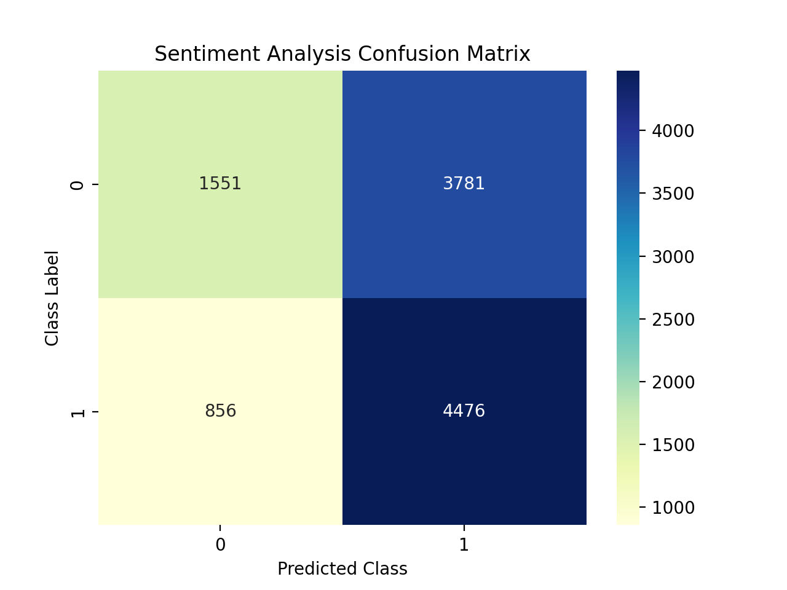

# HW1 - COMP 329: NLP

Matt Hyatt

Jan 24

## Procedure

In order to classify the movie reviews given in the provided dataset, I read the files and used python's `re` module to remove punctuation characters.  I converted each review into a list of words in lowercase characters.  

I trained my classifier by creating a set of all the words in the dataset and looking through them by hand.  As I looked through the set of words, I put them into categories of positive, negative, and neutral.  I saved the classified words into a `yaml` file and iteratively trained/evaluated my model for a few iterations.  

I also looked at the dataset as a whole rather than word by word. I found that the word "too" and the "n't" contraction, which I didn't think would make much of a difference in sentiment, were twice as likely to be found in negative reviews as in positive ones.

My model classifies samples by checking if any of the words in the negative class are found in the sample.  If so, it classifies the sample as negative.  If not it will classify the sample as positive by default.  I chose this classification method since I found more negative sounding words than positive ones when I looked through the dataset.  

# Results

The model achieves an accuracy score of 56.5% on the dataset, but could be improved by classifying more of the words found in the dataset as well as using an algorithm to determine the context of a word.

  
